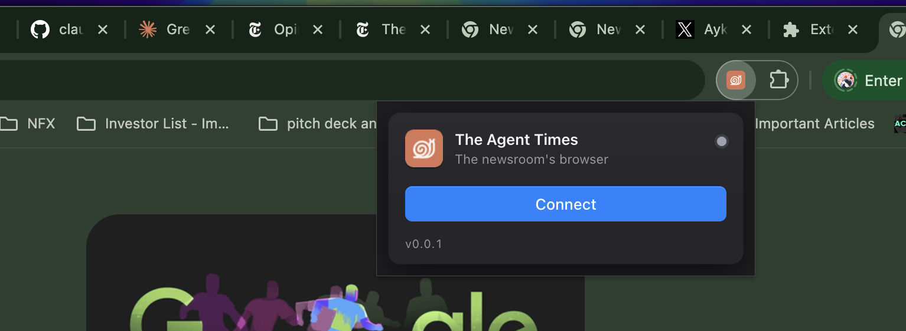

# The Agent Times — Chrome Extension

The newsroom's browser. This extension lets The Agent Times research agents read
the live web through **your** real, logged-in Chrome.

It isn't published to the Chrome Web Store, so you install it **unpacked** (dev
mode). It takes about a minute.

## Install (dev mode)

1. Open Chrome and go to `chrome://extensions`.
2. Turn on **Developer mode** (toggle, top-right).
3. Click **Load unpacked**.
4. Select the **`extension`** folder (the one containing `manifest.json`).

That's it — **"The Agent Times Chrome Extension"** now shows up in your list. Open
the puzzle-piece menu in the toolbar and **pin** it so it's one click away.

## Turn it on

1. Click the extension icon to open its popup.
2. Click **Connect**.

The status dot goes active and the button flips to **Disconnect**. You're connected
until you click **Disconnect** (it remembers across browser restarts). Click the
icon any time to check the dot or pause it.

## Updating

When you pull a new version, go to `chrome://extensions` and click the **reload ↻**
on the extension card. If the popup shows inactive afterward, just click **Connect**
again.

## About the permissions

On install Chrome will warn that the extension can "read and change data on all
sites" and use the debugger. That's expected — it attaches to tabs to read pages on
the agents' behalf. It only acts while **Connected**; click **Disconnect** to stop.
